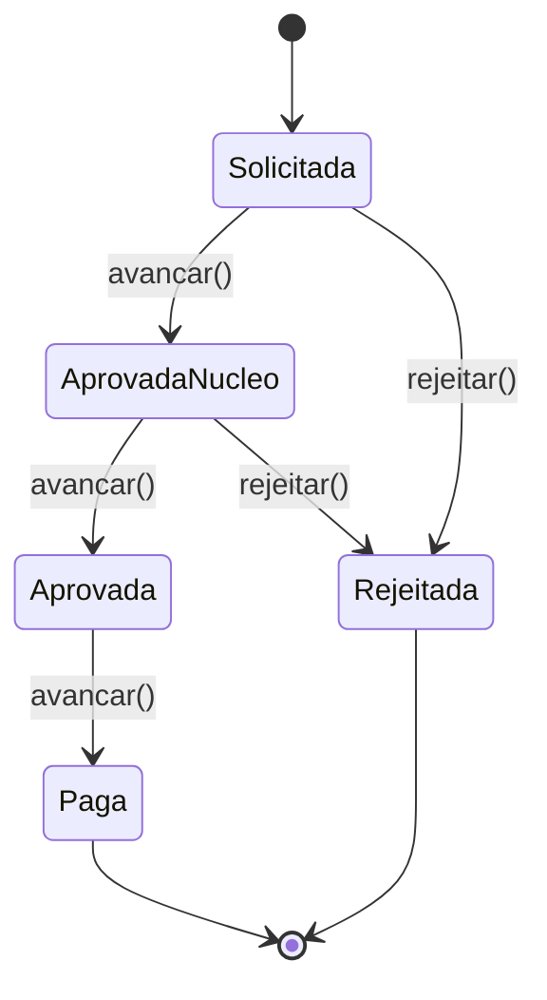

# php-rh-engine

[](https://github.com/wescaxeta/php-rh-engine/actions/workflows/ci.yml)


[](LICENSE)

Motor de regras de negócio para **Recursos Humanos**: férias, diárias de viagem e afastamentos.

É uma biblioteca PHP sem framework, focada em **modelagem de domínio, testes e qualidade de código**.
Ela recria regras que implementei em um sistema de RH multi-tenant em produção
(PHP + PostgreSQL, usado por órgãos de defesa agropecuária de 9 estados), sem nenhum código ou dado proprietário.

---

## Destaques técnicos

| O quê | Por quê |
|---|---|
| **Value Object `Money` em centavos (`int`)** | `float` não serve para dinheiro (`0.1 + 0.2 !== 0.3`). Toda a aritmética é inteira e imutável. |
| **Máquina de estados com `enum`** | As transições do fluxo de aprovação vivem no próprio `SituacaoDiaria`, e um `match` exaustivo garante que nenhum estado fique sem tratamento. |
| **Hierarquia de exceções de domínio** | `RhException` (abstrata), com subclasses específicas e *named constructors* (`ParcelaFeriasInvalidaException::saldoInsuficiente(...)`). A aplicação trata tudo com um único `catch` ou erro por erro. |
| **Correção de bug real de datas** | `DateTime::modify('+1 month')` sobre 31/01 cai em 03/03. `Support\Datas::adicionarMeses` ajusta para o último dia do mês, e os testes cobrem admissões em 31/01 e 29/02. |
| **PHPStan nível max + strict rules** | Zero erros, sem baseline e sem `@phpstan-ignore`. |
| **Testes orientados a cenários** | PHPUnit 13 com `#[DataProvider]` e casos nomeados em português. O `--testdox` gera uma especificação legível das regras. |
| **CI em dois jobs** | Um job de qualidade (estilo + análise estática) e outro de testes com matriz PHP 8.4/8.5, cobertura via PCOV no resumo do job e Dependabot para dependências. |
| **Ambiente reproduzível** | `Dockerfile` + `compose.yaml` + `Makefile`: basta ter Docker para rodar tudo. |

Recursos do PHP moderno usados: `strict_types`, enums com métodos, `readonly` classes, constructor promotion,
constantes tipadas (8.3), named arguments, `match`, `throw` como expressão e classes `final` por padrão.

## Regras de negócio

### Férias
- Período aquisitivo calculado a partir da admissão, com ajuste de fim de mês.
- Período concessivo: prazo de 12 meses após o aquisitivo para conceder as férias.
- Saldo com múltiplos gozos parciais e períodos acumulados.
- Parcelamento: no mínimo 10 dias por parcela e no máximo 3 parcelas por período.

### Diárias
- Valor com pernoite (100%) e sem pernoite (50%), com arredondamento *half-up* no centavo.
- Fluxo de aprovação em múltiplos níveis, com rejeição permitida antes da aprovação final:



### Afastamentos
- Validação de pessoa e de intervalo de datas. O motivo é validado pelo tipo (`enum`).
- Desbloqueio de horário de ponto por motivo (afastamento a serviço) ou por cargo comissionado.

## Exemplo de uso

```php
use RhEngine\Enum\SituacaoDiaria;
use RhEngine\Exception\RhException;
use RhEngine\Model\Diaria\Calculator;
use RhEngine\Model\Diaria\FluxoAprovacao;
use RhEngine\Model\Ferias\Calculator as FeriasCalculator;
use RhEngine\ValueObject\Money;

// Diária: 3 dias sem pernoite
$valor = (new Calculator())->calcularValor(Money::deReais('180.50'), quantidadeDias: 3, comPernoite: false);
echo $valor->formatar(); // R$ 270,75

// Fluxo de aprovação
$fluxo    = new FluxoAprovacao();
$situacao = $fluxo->avancar(SituacaoDiaria::Solicitada); // AprovadaNucleo

// Férias
$ferias  = new FeriasCalculator();
$periodo = $ferias->calcularPeriodoAquisitivo(
    dataAdmissao: new DateTimeImmutable('2024-01-31'),
    referencia: new DateTimeImmutable('2025-06-01'),
);
echo $periodo->inicio->format('d/m/Y'); // 31/01/2025

try {
    $ferias->validarParcela(diasSolicitados: 5, saldoAtual: 30, parcelasUsadas: 0);
} catch (RhException $e) {
    echo $e->getMessage(); // Parcela mínima é de 10 dias.
}
```

## Como rodar

### Com Docker (recomendado)

```bash
git clone https://github.com/wescaxeta/php-rh-engine.git
cd php-rh-engine
make build install
make ci        # estilo + análise estática + testes
```

`make help` lista todos os comandos.

### Localmente (PHP 8.4+ e Composer)

```bash
composer install
composer test           # PHPUnit (--testdox)
composer analyse        # PHPStan nível max
composer cs             # verifica estilo (PER-CS 2.0)
composer cs:fix         # corrige estilo
composer ci             # tudo acima, igual ao GitHub Actions
composer test:coverage  # cobertura (requer PCOV ou Xdebug)
```

## Estrutura

```
src/
├── Enum/                     # Estados e motivos, com as regras de transição
│   ├── MotivoAfastamento.php
│   ├── SituacaoDiaria.php
│   └── SituacaoFerias.php
├── Exception/                # Hierarquia de exceções de domínio
│   ├── RhException.php       # base abstrata
│   ├── DadoInvalidoException.php
│   ├── ParcelaFeriasInvalidaException.php
│   └── TransicaoInvalidaException.php
├── Model/                    # Serviços de domínio, sem estado
│   ├── Afastamento/Validator.php
│   ├── Diaria/
│   │   ├── Calculator.php
│   │   └── FluxoAprovacao.php
│   └── Ferias/
│       ├── Calculator.php
│       └── PeriodoAquisitivo.php
├── Support/Datas.php         # Aritmética de datas sem "estouro" de mês
└── ValueObject/Money.php
tests/Unit/                   # Um arquivo por regra, com cenários via DataProvider
```

## Roadmap

- [ ] Camada HTTP (API REST) consumindo a biblioteca, com documentação OpenAPI
- [ ] Persistência em PostgreSQL com migrations
- [ ] Regras parametrizáveis por estado (Strategy), refletindo a variação de legislação entre UFs
- [ ] Mutation testing com Infection

## Contexto de origem

As regras vêm de um sistema estadual do setor agropecuário que opera em modelo multi-tenant
(uma instância por estado, 9 UFs). Nele, as regras de RH variam conforme a legislação estadual e o tipo de
vínculo funcional. Este repositório isola essas regras em um núcleo testável e independente de framework.

## Licença

[MIT](LICENSE)
